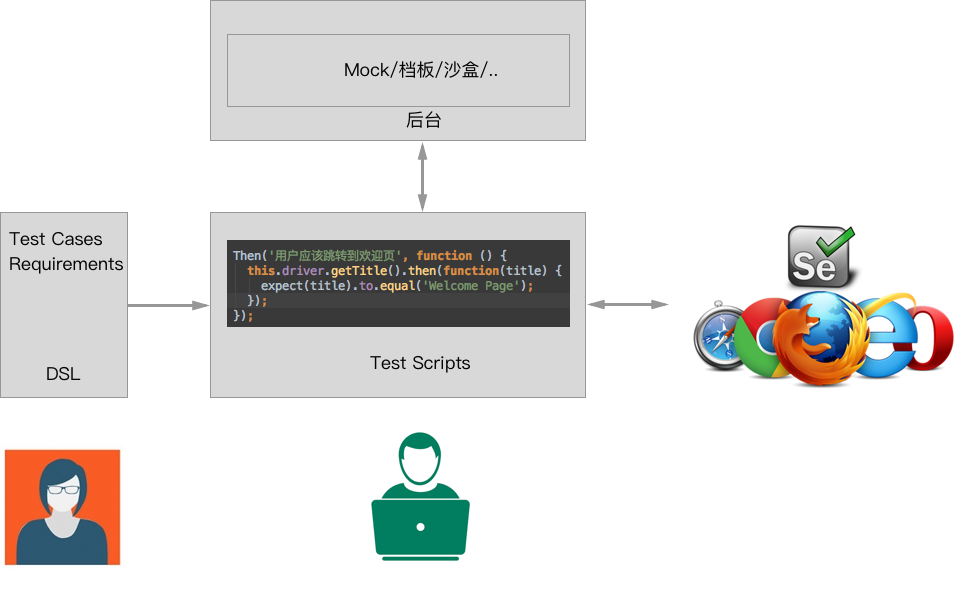

BDD 框架对比: Cucumber.js vs Robot Framework vs Gauge.js
===

BDD Process
---




COMPARE
---

 x          |  Cucumber                          |Gauge                |   Robot   
------------|------------------------------------|----------------------|-----------
编程语言支持 | Java,Ruby,JavaScript 等 13 种语言    | Java, JavaScript, Ruby 等 6 种语言 | Python, Java, C  
支持的系统   | 所有主流系统    | 所有主流系统  | 所有主流系统  
多语言支持   |  UTF-8        | UTF-8          | 用户关键字及用例层面支持UTF-8
中文社区支持 | 完善           |     待完善      |   完善   
Report     | JS 不支持 HTML  |   粗粒度          | 细粒度 
失败时截图   | 不支持         |   支持          | 支持

Cucumber.js
--

> Cucumber 是一个能够理解用普通语言 描述的测试用例的支持行为驱动开发（BDD）的自动化测试工具，用Ruby编写，支持Java和.Net等多种开发语言。
  
 - 使用自然语言，更易读
 - 支持表格参数
 - 支持多种格式的Report：html、junit etc.
 - 支持多种语言
 - 支持四种状态的测试步骤：Passed、Failed、Skipped、Pending
 - 支持使用变形器消除重复
 - 一个商用的在线 Cucumber 系统：Cucumber Pro

### Code Examples

```
# language: zh-CN
功能: 失败的登录

  场景大纲: 失败的登录
    假设 当我在网站的首页
    当 输入用户名 <用户名>
    当 输入密码 <密码>
    当 提交登录信息
    那么 页面应该返回 "Error Page"

    例子:
      |用户名     |密码      |
      |'Jan1'    |'password'|
      |'Jan2'    |'password'|
```

Robot Framework
---

> Robot Framework是一款python编写的功能自动化测试框架。具备良好的可扩展性，支持关键字驱动，可以同时测试多种类型的客户端或者接口，可以进行分布式测试执行。 


关键特性：

 - 使用关键字的机制，更容易上手
 - 提供了RIDE，对于不熟悉编码的人来说比较友好
 - 能够精细的控制关键字的scope
 - Log 和 Report 非常好
 - 使用变量文件的机制来描述不同的环境
 - 丰富的关键字库
 - 内置变量

### Code Examples

```
*** Settings ***
Documentation     登录测试 2
...
Suite Setup       打开浏览器到登录页1
Suite Teardown    Close Browser
Test Setup        转到登录页
Test Template     使用错误的失败凭据应该登录失败
Resource          resource.robot

*** Test Cases ***               USER NAME        PASSWORD
无效的用户名                      invalid          ${VALID PASSWORD}
无效的密码                        ${VALID USER}    invalid
无效的用户名和密码                 invalid          whatever

*** Keywords ***
使用错误的失败凭据应该登录失败
    [Arguments]    ${username}    ${password}
    输入用户名    ${username}
    输入密码    ${password}
    提交登录信息
    登录应该不成功

登录应该不成功
    Location Should Be    ${ERROR URL}
    Title Should Be    Error Page
```

Gauge
---

> Gauge 是 Go 开发的一个跨平台测试自动化工具。它给作者提供了用商业语言测试用例的能力。

关键特性：

 - 基于 markdown 的丰富的标记
 - 支持用任何程序语言来编写测试代码
 - 支持 plugin 的模块化架构
 - 跨语言实现一致性。
 - 简单，灵活和丰富的语法
 - 开源的，因此它可以自由共享，同时被他人改进
 - 商业语言测试 : 支持可执行文件的概念
 - 帮助您创建可维护和可理解的测试套件
 - 支持外部数据来源
 - IDE Support

### Code Examples

```
失败的登录
===

     |用户名   |密码     |
     |--------|--------|
     |Jan1    |password|
     |Jan2    |password|

失败的登录
-----------
* 当我在网站的首页
* 输入用户名 <用户名>
* 输入密码 <密码>
* 提交登录信息
* 页面应该返回 "Error Page"
```

SETUP
===

Requirements: Java 8, Node.js 8

Cucumber.js
---

1.安装

```
cd cucumber
yarn install
```

2.测试

```
npm test
```


Robot Framework
---

1.安装依赖

```
pip install -r requirements.txt
```

2.测试

```
robot robot_tests
```

Gauge
---

### Gauge Puppeteer

1.安装 Gauge

```
brew install gauge
```

2.执行安装

```
yarn install
```

### Gauge.js

1.安装 Gauge

```
brew install gauge
```

2.执行安装

```
yarn install
```

3.安装 local 版 selenium

```
selenium-standalone install
```

4.Terminal 1:

```
selenium-standalone start
```

5.Terminal 2:

```
npm test
```

其它
---

### Gauge 笔记

```
$ gauge init -t

ruby_selenium
ruby
python
js_webdriver
js_puppeteer
js
java_maven_selenium
java_maven
java
go_agouti
csharp

Run `gauge init <template_name>` to create a new Gauge project.
```
