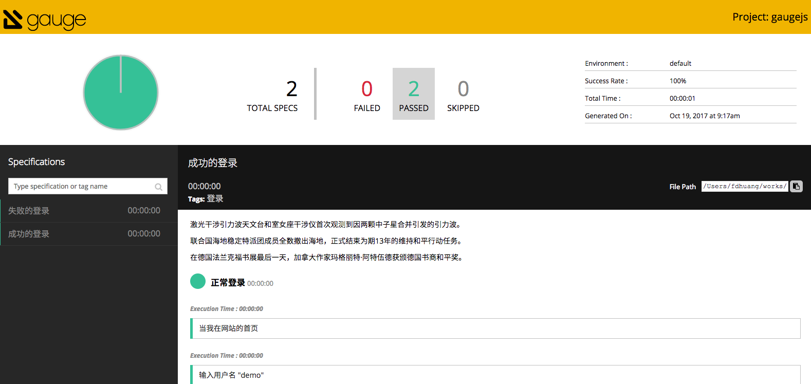

最近，项目上出于系统性稳定性、减少测试工作量考虑，打算在 Web 前端引入 BDD。由于上一个项目写了一定的 Cucumber 代码（BDD 测试框架之一），这个框架选型的责任便落到了我的肩膀上了。

在我们进行框架选型的时候，着重考虑了一个因素：**测试实现脚本是由开发人员编写的，因此最好寻找 JavaScript 支持的框架**。在搜索了一天后，选择了三个框架
Cucumber、Robot、Gauge。以下是上述的三个框架入选的原因：

**Cucumber**，团队的开发人员有一些有相关的开发经验、支持 JavaScript。

**Robot Framework**，测试人员接受过相关的培训、不支持 JavaScript。

**Gauge**，可以生成更好的测试报告及自由的书写、支持 JavaScript。不过，主要是我写腻了
Cucumber。

随后，便使用三个不同的框架写了几个 UI 测试的
DEMO。在开始之前，让我们了解什么是 BDD。

BDD
---

> Behavior Driven Development，行为驱动开发是一种敏捷软件开发的技术，它鼓励软件项目中的开发者、QA 和非技术人员或商业参与者之间的协作。

与一般的自动化测试（如单元测试、服务测试、UI 测试）不一样的是，BDD
是由多方参与的测试开发方式。如在使用 Protractor 写 Angular 的 E2E
测试的时候，所以的测试都是前端测试人员编写的。BDD 最重要的一个特性是：由**非开发人员编写测试用例**，而这些测试用例是使用**自然语言编写的 DSL（领域特定语言）**。

换多话来说，业务人员、测试人员、客户等利益相关者，以习惯的方式编写相关的测试用例，再由开发人员去实现相关的测试。如下图所示：


由业务人员编写的测试用例，将是使用如下的形式实现的：

```
* 当我在网站的首页
* 输入用户名 "demo"
* 输入密码 "mode"
* 提交登录信息
* 用户应该跳转到欢迎页
```

对于能支持中文的 BDD
框架来说，这就是业务人员和测试人员等编写的用例，他们能轻松地编写出这样的用例，而开发人员便是去实现这一个又一个的
DSL 语句。

在我之前的一个项目里，我们遇到了一个问题：**测试用例也是由开发人员编写的**。这种做法不仅不能体现 BDD 的价值，而且对于开发人员来说，这是在糟蹋代码。如果完全是由开发人员编写的测试，那么为什么我们需要写一个额外的 DSL 层呢？

接下来，让我们看看三个测试的一个简单对比表：

BDD 框架对比: Cucumber.js vs Robot Framework vs Gauge.js
---

 x          |  Cucumber                          |Gauge                |   Robot   
------------|------------------------------------|----------------------|-----------
编程语言支持 | Java,Ruby,JavaScript 等 13 种语言    | Java, JavaScript, Ruby 等 6 种语言 | Python, Java, C  
支持的系统   | 所有主流系统    | 所有主流系统  | 所有主流系统  
多语言支持   |  UTF-8        | UTF-8          | 用户关键字及用例层面支持UTF-8
中文社区支持 | 完善           |     待完善      |   完善   
Report     | JS 不支持 HTML  |   粗粒度          | 细粒度 
失败时截图   | 不支持         |   支持          | 支持

从某程程度上来看，三个框架差不了多少，每个框架也各自都有自己的问题。

1. Cucumber 的 Javascript 版本不支持 HTML 的报表生成。
2. Gauge 虽然比较适合我们的要求，但是相关的中文资料比较少。
3. Robot 主要的问题是不支持 JavaScript，以及要按 Robot
   定义的方式来编写代码。

以下是三个框架的示例及详细的对比。

Cucumber.js
--

> Cucumber 是一个能够理解用普通语言 描述的测试用例的支持行为驱动开发（BDD）的自动化测试工具，用Ruby编写，支持Java和.Net等多种开发语言。
  
 - 使用自然语言，更易读
 - 支持表格参数
 - 支持多种格式的Report：html、junit etc.
 - 支持多种语言
 - 支持四种状态的测试步骤：Passed、Failed、Skipped、Pending
 - 支持使用变形器消除重复
 - 一个商用的在线 Cucumber 系统：Cucumber Pro

### DSL Code Examples

示例代码：[https://github.com/phodal/bdd-frameworks-compare/tree/master/cucumber](https://github.com/phodal/bdd-frameworks-compare/tree/master/cucumber)

```cucumber
# language: zh-CN
功能: 失败的登录

  场景大纲: 失败的登录
    假设 当我在网站的首页
    当 输入用户名 <用户名>
    当 输入密码 <密码>
    当 提交登录信息
    那么 页面应该返回 "Error Page"

    例子:
      |用户名     |密码      |
      |'Jan1'    |'password'|
      |'Jan2'    |'password'|
```

Cucumber 支持比较固定的 DSL 格式，即三段式
Given-When-Then，对应的中文便是：假设-当-那么。作为一个历史悠久的框架，它的中文资料相当的丰富，只是在
JavaScript 方面有些不足，不能生成对应的 HTML 报告。

其实现代码如下所示：

### Step Code Examples

```javascript
defineSupportCode(function({Given, When, Then}) {
    Given('当我在网站的首页', function() {
        return this.driver.get('http://0.0.0.0:7272/');
    });

    When('输入用户名 {string}', function (text) {
        return this.driver.findElement(By.id('username_field')).sendKeys(text)
    });

    When('输入密码 {string}', function (text) {
        return this.driver.findElement(By.id('password_field')).sendKeys(text)
    });

    When('提交登录信息', function () {
        return this.driver.findElement(By.id('login_button')).click()
    });

    Then('页面应该返回 {string}', function (string) {
      this.driver.getTitle().then(function(title) {
        expect(title).to.equal(string);
      });
    });
});
```

从代码实现上来说，也是固定的三段式。其底层依赖于 Selenium，因此写法上与
Gauge 的区别并不大。

Robot Framework
---

> Robot Framework是一款python编写的功能自动化测试框架。具备良好的可扩展性，支持关键字驱动，可以同时测试多种类型的客户端或者接口，可以进行分布式测试执行。 

关键特性：

 - 使用关键字的机制，更容易上手
 - 提供了RIDE，对于不熟悉编码的人来说比较友好
 - 能够精细的控制关键字的scope
 - Log 和 Report 非常好
 - 使用变量文件的机制来描述不同的环境
 - 丰富的关键字库
 - 内置变量

### DSL Code Examples

示例代码：[https://github.com/phodal/bdd-frameworks-compare/tree/master/robot](https://github.com/phodal/bdd-frameworks-compare/tree/master/robot)

```robot
*** Settings ***
Documentation     登录测试 2
...
Suite Setup       打开浏览器到登录页1
Suite Teardown    Close Browser
Test Setup        转到登录页
Test Template     使用错误的失败凭据应该登录失败
Resource          resource.robot

*** Test Cases ***               USER NAME        PASSWORD
无效的用户名                      invalid          ${VALID PASSWORD}
无效的密码                        ${VALID USER}    invalid
无效的用户名和密码                 invalid          whatever

*** Keywords ***
使用错误的失败凭据应该登录失败
    [Arguments]    ${username}    ${password}
    输入用户名    ${username}
    输入密码    ${password}
    提交登录信息
    登录应该不成功

登录应该不成功
    Location Should Be    ${ERROR URL}
    Title Should Be    Error Page
```

从上面的代码来看，Robot
在某些特定的关键字上，必须使用英语。在关键的代码如关闭浏览器，仍然需要使用
Close Browser 英语这些来实现。

### Step Code Examples

```robot
打开浏览器到登录页
    Open Browser    ${LOGIN URL}    ${BROWSER}
    Maximize Browser Window
    Set Selenium Speed    ${DELAY}
    Login Page Should Be Open

Login Page Should Be Open
    Title Should Be    Login Page

转到登录页
    Go To    ${LOGIN URL}
    Login Page Should Be Open

输入用户名
    [Arguments]    ${username}
    Input Text    username_field    ${username}

输入密码
    [Arguments]    ${password}
    Input Text    password_field    ${password}

提交登录信息
    Click Button    login_button

应该跳转到欢迎页
    Location Should Be    ${WELCOME URL}
    Title Should Be        Welcome Page
```

与上面的 Cucumber 相比，Robot
对于英语的非开发人员来说更加友好。换句话来说，Robot 更像是一个适合于 QA
的语言。作为一个开发人员，可能不太喜欢这种形式。

### 报告示例

不过，Robot
提供了一份说尽的报告。细致的展示了每一个测试，以及其步骤时间等等。


Gauge
---

> Gauge 是 Go 开发的一个跨平台测试自动化工具。它给作者提供了用商业语言测试用例的能力。

关键特性：

 - 基于 markdown 的丰富的标记
 - 支持用任何程序语言来编写测试代码
 - 支持 plugin 的模块化架构
 - 跨语言实现一致性。
 - 简单，灵活和丰富的语法
 - 开源的，因此它可以自由共享，同时被他人改进
 - 商业语言测试 : 支持可执行文件的概念
 - 帮助您创建可维护和可理解的测试套件
 - 支持外部数据来源
 - IDE Support

### DSL Code Examples

示例代码：[https://github.com/phodal/bdd-frameworks-compare/tree/master/gaugejs](https://github.com/phodal/bdd-frameworks-compare/tree/master/gaugejs)

```markdown
失败的登录
===

     |用户名   |密码     |
     |--------|--------|
     |Jan1    |password|
     |Jan2    |password|

失败的登录
-----------
* 当我在网站的首页
* 输入用户名 <用户名>
* 输入密码 <密码>
* 提交登录信息
* 页面应该返回 "Error Page"
```

与 Robot 和 Cucumber 不一样的是，Gauge 使用的是大家更熟悉的 Markdown
形式的 DSL。并且从形式上来说，更加自由。List
中的每一行，就代表着一个元素。因此，其对应的实现代码也更加的自由。

### Step Code Examples

```javascript
step("当我在网站的首页", async function () {
  await page.goto('http://0.0.0.0:7272/');
});

step("输入用户名 <query>", async function (query) {
  await page.click('#username_field');
  await page.type(query)
});

step("输入密码 <query>", async function (query) {
  await page.click('#password_field');
  await page.type(query)
});

step("提交登录信息", async function () {
  await page.click('#login_button')
});

step("页面应该返回 <query>", async function(query){
  await page.waitFor('h1');
  const text = await await page.$eval('#container h1', h1 => {
    return h1.innerHTML;
  });

  expect(text).to.equal(query);
});
```

上面采用的是 Node.js 8 支持的异步写法，除此与 cucumber.js
写的代码并没有太多的差异。

### 报告示例

至于，Gauge 生成的 UI 并没有 Robot 那么详细，但是看上去现代。



